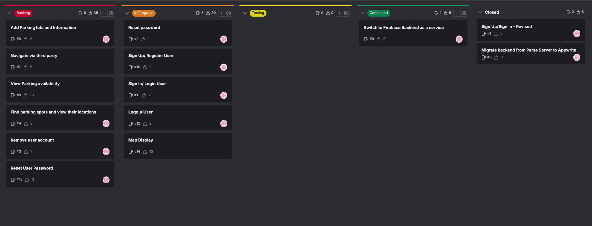

# Weekly Standup Notes

This document is used to record the weekly standup notes for the project.

## Date: 18/01/2024

## Last Week's Action Items:

- Make more progress into issues created once exams are completed.

## Updates:

- Board updated: see screenshot: 
- Firebase was successfully integrated into the project and significant progress was made into authentication management.
- A new branch (auth-management-firebase) was created for authentication management using firebase.
- Basic functionality for signing up and signing in has been implemented
- Definition of Done and Acceptance Criteria for issues sign up, sign in, reset password have been updated.
- A new issue was created for viewing Map display. This is essential to provide a visual representation for intended tickets for the sprint namely: Find parking spots and view locations, View parking availability, Navigate via third party.
- The sign up / sign in issue was split into two separate issues to make it easier to manage and track progress.

## Action Item:
- Continue working on issues in the In Progress column
