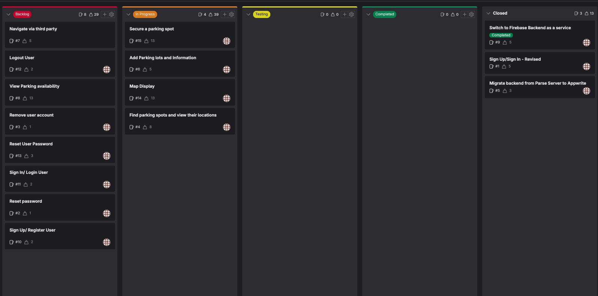
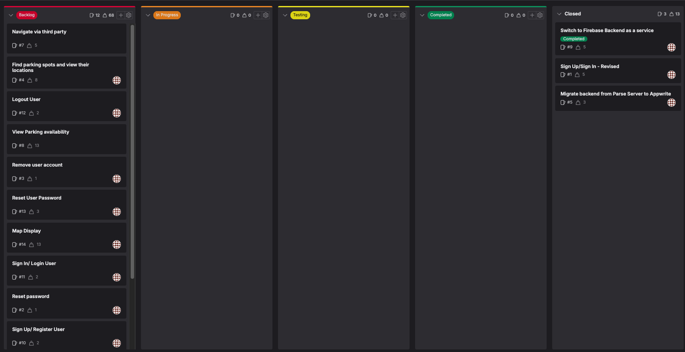

# Sprint Planning Notes

## Date and Participants

- **Date**: 22/03/2024
- **Participants**: Jedidiah

## Sprint Goal

End of sprint4 - 
Beginning of sprint5 - 

The main goal of this sprint is to create ensure that the core requirements are achieved.

## Product Backlog Items Discussed

To achieve an MVP some tickets will be picked up later once the core functionality (MVP) is completed with more focus on backend as most 
frontend parts are near completion.

## Decisions Made

- The aim of this sprint is to focus on or prioritise issues that contribute to achieving an MVP:
  - Map Display - #14
  - Add parking lots and information - #6
  - Find parking spots and view their locations - #4
  - Secure a parking spot - #15

## Action Items

- Focus on achieving an MVP with focus on backend

## Issues Raised

No issues raised

<!-- - Any issues or concerns that were raised during the meeting. Include how (or if) they were resolved, or what the next steps are for addressing them like involving supervisor. -->

## Next Steps

<!-- plans to do next, such as start work on the sprint backlog items, hold a follow-up meeting, etc. -->

- Start work on the issues mentioned above.
