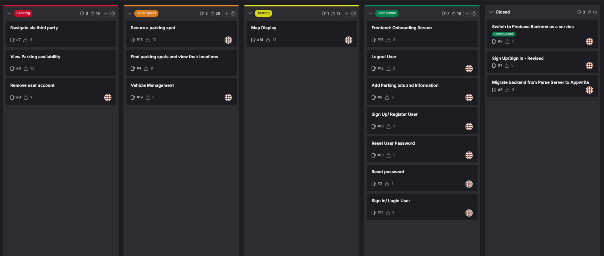

# Sprint Planning Notes

## Date and Participants

- **Date**: 24/03/2024 - 24/04/2024
- **Participants**: Jedidiah

## Sprint Goal

End of sprint5 - 
Beginning of sprint5 - 

The main goal of this sprint is to focus on the parking Owner and Admin website with little focus on driver as most of the driver's functionality is near completion.

## Product Backlog Items Discussed

## Decisions Made

- The aim of this sprint is to focus on:
  - Parking Owner and admin website - #TBD
  - Secure a parking spot - #15

## Action Items

- Focus on achieving an MVP with focus on backend

## Issues Raised

No issues raised

## Next Steps

- Create the necessary issues for parking owner and admin website
- Start work on the issues mentioned above.
